# Diagramas de Flujo - Salud Sin Fronteras

Este documento contiene los diagramas de flujo de los principales procesos de la plataforma.

---

## 1. Flujo de Autenticación

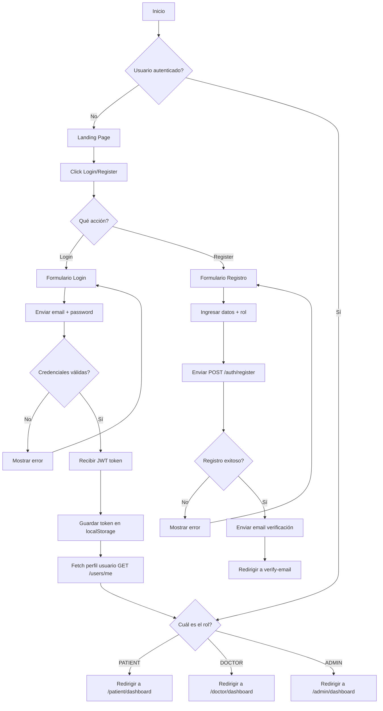

---

## 2. Flujo Paciente: Agendar Cita

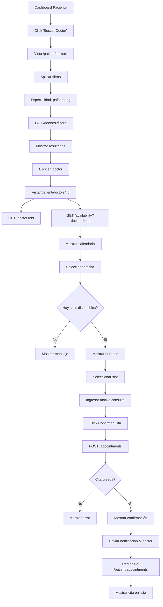

---

## 3. Flujo Doctor: Confirmar y Atender Cita

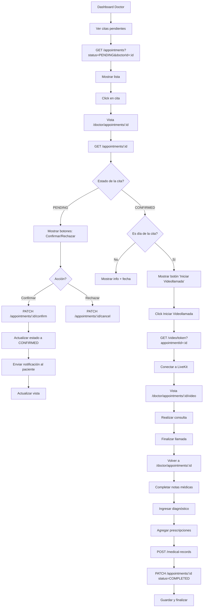

---

## 4. Flujo de Videollamada

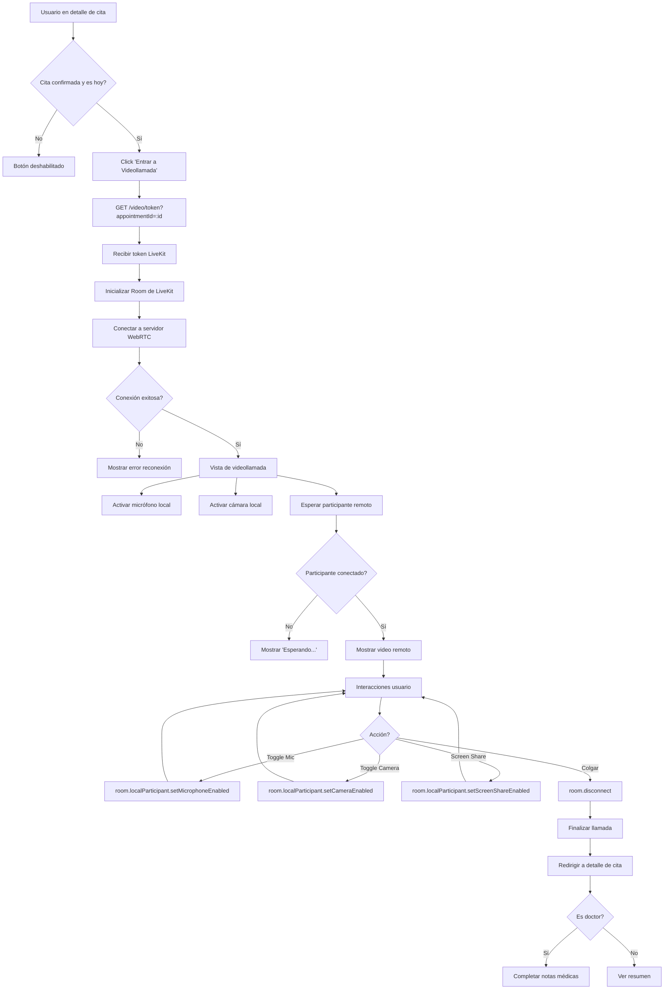

---

## 5. Flujo de Chat con Traducción

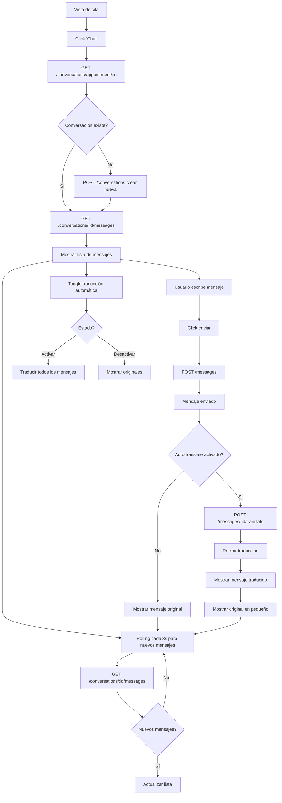

---

## 6. Flujo Admin: Verificar Doctor

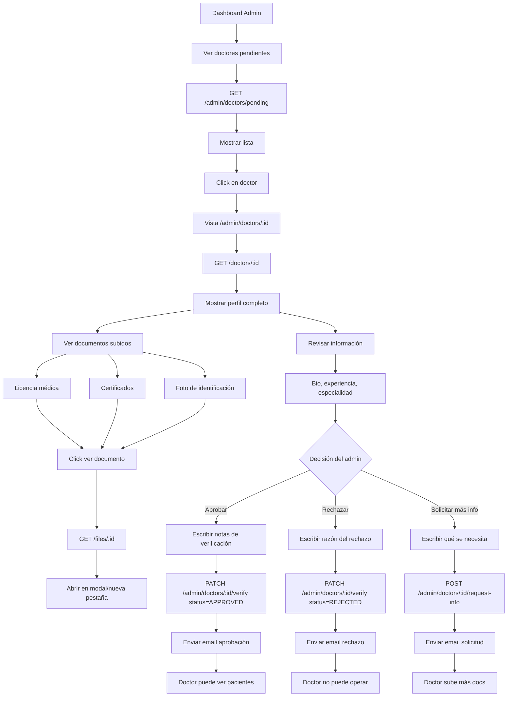

---

## 7. Flujo de Suscripción/Upgrade

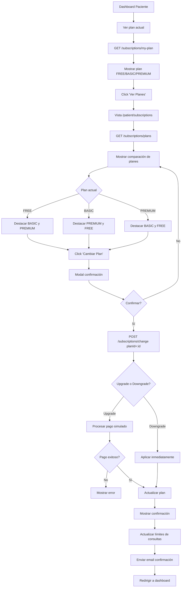

---

## 8. Arquitectura de Componentes React

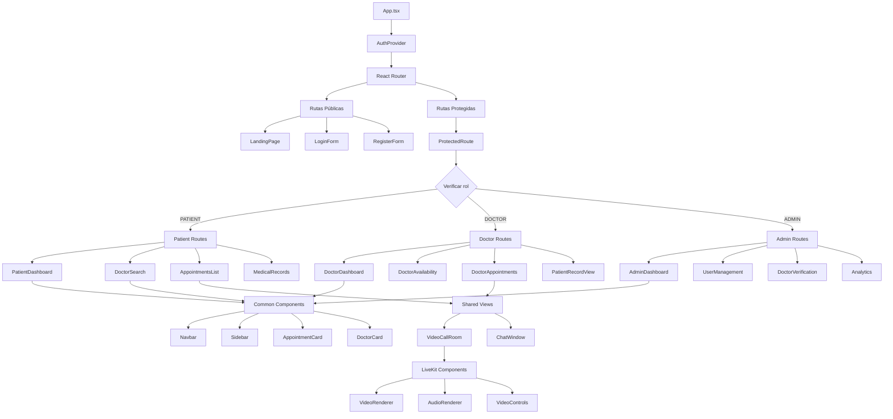

---

## 9. Flujo de Estado con React Query

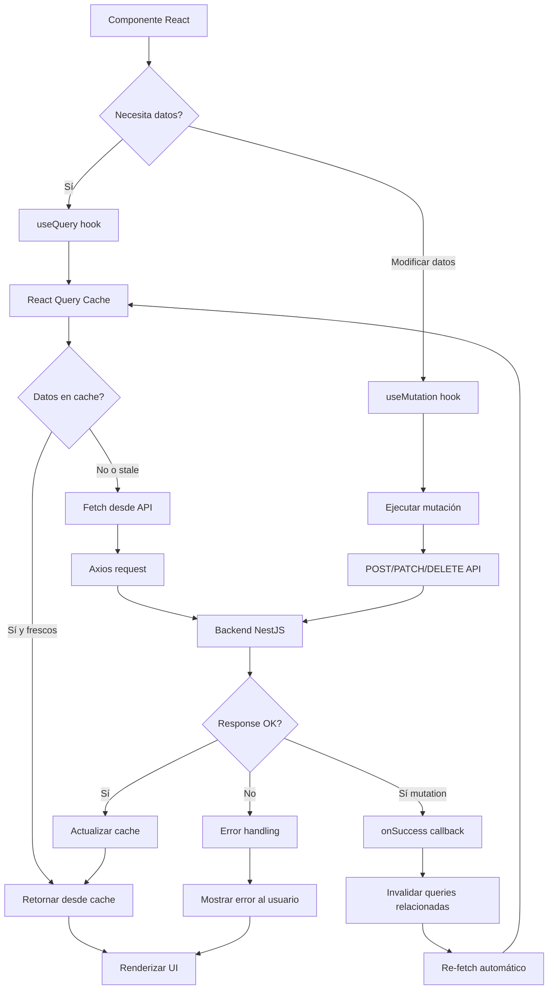

---

## 10. Sistema de Autenticación y Guards

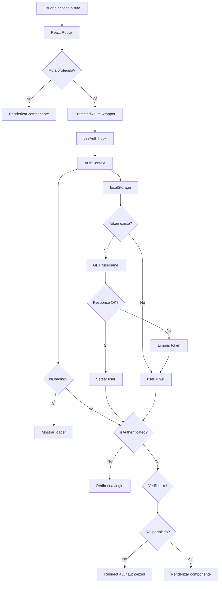

---

## 11. Flujo de Datos: Crear Registro Médico

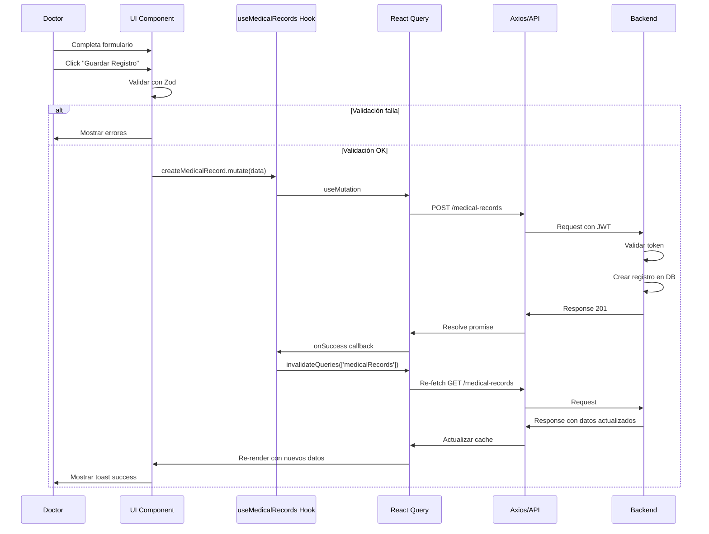

---

## 12. Arquitectura de Carpetas

```mermaid
graph TD
    A[src/] --> B[components/]
    A --> C[contexts/]
    A --> D[hooks/]
    A --> E[services/]
    A --> F[types/]
    A --> G[lib/]
    A --> H[locales/]

    B --> B1[ui/]
    B --> B2[common/]
    B --> B3[auth/]
    B --> B4[patient/]
    B --> B5[doctor/]
    B --> B6[admin/]
    B --> B7[video/]
    B --> B8[chat/]

    B1 --> B1A[button.tsx]
    B1 --> B1B[card.tsx]
    B1 --> B1C[dialog.tsx]

    B2 --> B2A[Navbar.tsx]
    B2 --> B2B[Sidebar.tsx]
    B2 --> B2C[DoctorCard.tsx]

    B4 --> B4A[PatientDashboard.tsx]
    B4 --> B4B[DoctorSearch.tsx]
    B4 --> B4C[AppointmentsList.tsx]

    C --> C1[AuthContext.tsx]
    C --> C2[ThemeContext.tsx]
    C --> C3[LanguageContext.tsx]

    D --> D1[useAuth.ts]
    D --> D2[useAppointments.ts]
    D --> D3[useVideoCall.ts]

    E --> E1[api.ts]
    E --> E2[auth.ts]
    E --> E3[appointments.ts]
    E --> E4[doctors.ts]

    F --> F1[user.ts]
    F --> F2[appointment.ts]
    F --> F3[doctor.ts]

    G --> G1[utils.ts]
    G --> G2[validators.ts]
    G --> G3[queryClient.ts]
    G --> G4[i18n.ts]

    H --> H1[es/translation.json]
    H --> H2[en/translation.json]
    H --> H3[fr/translation.json]
```

---

Estos diagramas proporcionan una visualización clara de:
- Flujos de usuario por rol
- Arquitectura de componentes
- Manejo de estado
- Integración con backend
- Sistema de autenticación
- Procesos de negocio clave

Puedes renderizar estos diagramas en GitHub, VS Code con extensiones Mermaid, o en cualquier visualizador compatible.
